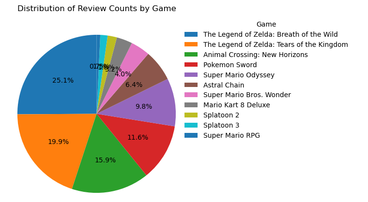

# 🎮 Nintendo Switch 게임 리뷰 감정 분석 프로젝트

## 🎯 프로젝트 목표
리뷰 평점(Score)만 믿고 게임을 구매해도 괜찮을까?
사람들이 작성한 텍스트 리뷰와 점수 평가 간에는 과연 일관성이 있을까?

이 프로젝트는 이러한 물음에서 출발했습니다.

Metacritic은 수많은 게임 리뷰를 **숫자 점수(0~100)**와 텍스트 리뷰 두 가지 방식으로 제공합니다. 하지만 때로는 높은 점수를 주면서도 텍스트에서는 비판적인 내용을 담거나, 낮은 점수를 주었지만 감성적으로는 긍정적인 표현을 하는 경우도 존재합니다.

따라서 본 프로젝트는 사용자 및 평론가 리뷰의 텍스트 데이터를 수집하고, 자연어 처리 기반 감정 분석 모델을 통해 **실제 감정(긍정/부정)**을 예측함으로써 점수와의 일관성을 분석하고자 합니다.

궁극적으로는 숫자 점수 외에도 텍스트 분석을 통해 보다 정교한 게임 리뷰 해석이 가능하다는 것을 보여주는 것이 본 프로젝트의 핵심 목표입니다.
---
## 🛠 사용 기술


---
## 📥 데이터 수집 및 전처리
- Metacritic 웹사이트에서 닌텐도 스위치 전용 게임의 리뷰를 크롤링
→ 웹사이트의 구조가 동적으로 구성되어 있기 때문에, Selenium 라이브러리와 크롬 드라이버를 활용한 자동 브라우저 제어 방식으로 데이터를 수집했습니다.
사용자 리뷰는 페이지 하단으로 스크롤을 반복하며 로딩되는 방식이며, 평론가 리뷰는 페이지 버튼을 클릭하며 순차적으로 이동해 데이터를 확보하였습니다.
- 이후 영어로 작성된 2,000개의 리뷰를 선별하였습니다.
단, 닌텐도 스위치 플랫폼 특성상 최고 점수(10점)를 준 리뷰가 다수 존재하여, 학습 데이터가 한쪽으로 편향되지 않도록 긍/부정 비율을 균형 있게 조정함으로써 학습의 일반성을 확보했습니다.
---

---
## 🧠 모델 학습 (DeBERTa 기반)

- 사전학습 모델: **DeBERTa v3 small (`microsoft/deberta-v3-small`)**
- 출력 라벨: **0 (부정), 1 (긍정)**

### ✅ 긍정(1) 기준
- **칭찬 표현 포함**: `best`, `love`, `great`, `excellent`, `masterpiece`, `amazing`, `fantastic`, `awesome`, `fun`
- **추천 어구 포함**: `"must play"`, `"I recommend"`, `"you should try"`
- **감탄 및 강조**: `!`, `really`, `absolutely` 등 긍정 강조 표현

### ❌ 부정(0) 기준
- **비판적 단어**: `boring`, `worst`, `bad`, `disappointed`, `underwhelming`, `awful`, `terrible`, `pointless`
- **불만 표현**: `"I regret"`, `"waste of time"`, `"not fun"`, `"no point"`
- **부정 강조**: `really bad`, `completely boring`

---
## 📁 프로젝트 폴더 구조

```plaintext
Game_review/
├── .venv/                            # 가상환경
├── chromedriver-win64/              # 크롤링용 드라이버
│   └── chromedriver.exe
├── deberta_custom_model_metacritic/ # 학습된 모델 저장 경로
│   ├── config.json
│   ├── model.safetensors
│   ├── tokenizer_config.json
│   └── ...
├── all_metacritic_reviews1~3.csv    # 리뷰 원본 백업 데이터
├── metacritic_review.csv            # 크롤링된 전체 리뷰 데이터
├── metacritic_review_labeled.csv    # 라벨링 완료된 학습용 데이터
├── fine_tuned_DeBERTa.py            # DeBERTa 학습 스크립트
├── main2.py                         # 예측 및 검증용 실행 파일
├── datadownload.py                 # 크롤링 스크립트
└── README.md
```
---
## ✅ 모델 성능

- 전체 검증 데이터셋 기준 **정확도: 78%**
- 학습된 모델은 `deberta_custom_model_metacritic/` 폴더에 저장됨

---

## 😕 한계점 및 개선 방향

### ❗ 아쉬운 점
- 영어가 아닌 리뷰가 일부 포함되어 있어 모델 예측 안정성이 떨어질 수 있음
- 긍/부정 외에 **중립(보통)** 라벨을 추가하려 했으나 기준 정의가 모호하여 적용하지 못함
- 긍정 비율이 높은 편향된 데이터셋을 사용했음에도 불구하고 정확도가 높지 않다는 점이 한계로 지적됨

### 🔧 개선 방안
- **언어 감지** 및 **영어 외 리뷰 필터링** 기능 추가
- **중립 클래스 추가**를 위한 기준 정립 및 다중 클래스 분류(Multi-class classification) 적용
- **데이터 증강 기법** 도입 (예: Easy Data Augmentation)으로 소수 클래스 보완
- 단순 리뷰 텍스트 외에 **메타데이터(점수, 날짜 등)** 포함하여 멀티모달 분석 시도

---

